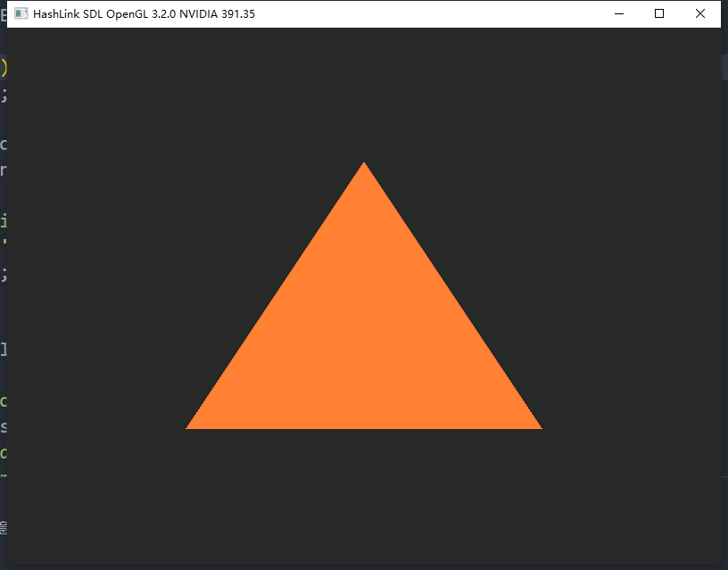

# OpenGL Rendering Triangles




This example demonstrates the basics of SDL and OpenGL usage with HashLink:

- Window creation
- OpenGL context initialization
- Vertex Buffer creation
- Rendering Triangles
- Basic event handling

Compile:

```bash
$ haxe hl.hxml
```

Run:

```bash
$ hl
```
